# 
# Mealing List
## Riccardo Giubilo - Project 4 (1 week solo)
---
## Brief
The purpose of this project was to build a Full-Stack application which was routed in a Python back-end and using Django REST framework to serve the data from a Postgres database. 
My idea was to create a recipes app in which you can read, post, update and delete data. 

## Project link
link

## Tech list
#### Front-end

* HTML
* SASS
* JavaScript
* React

#### Back-end
* Python
* Djnago

#### Database
* PostgreSQL

#### Development tools
* TablePlus
* Insomnia
* Git
* GitHub

---

## Planning

Once I had the idea and the sources to build my APIs I did the front-end and the back-end wireframes.

This is a part of the front-end wireframe.

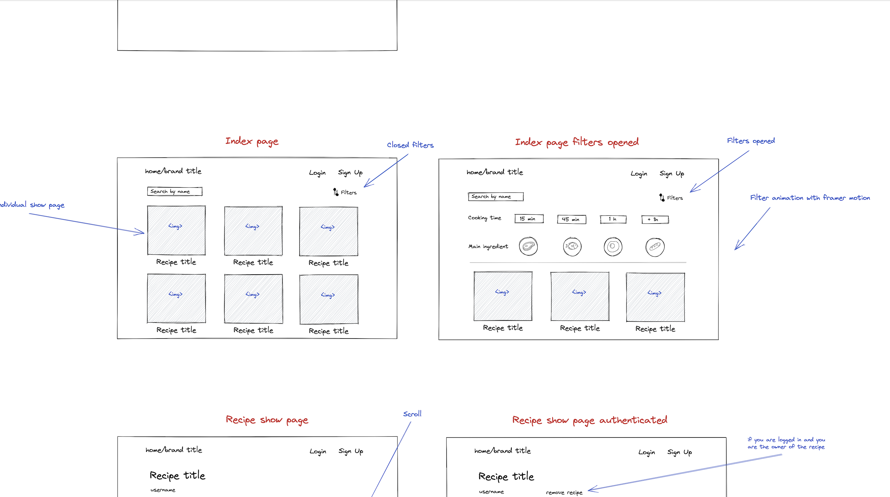

In the image above I made a diagram of the page in which all the recipes are displayed. At the right there is the same page but with the filters opened. 

Then I did the back-end wireframe in which I drew the models and relationships I needed in order to build the app.

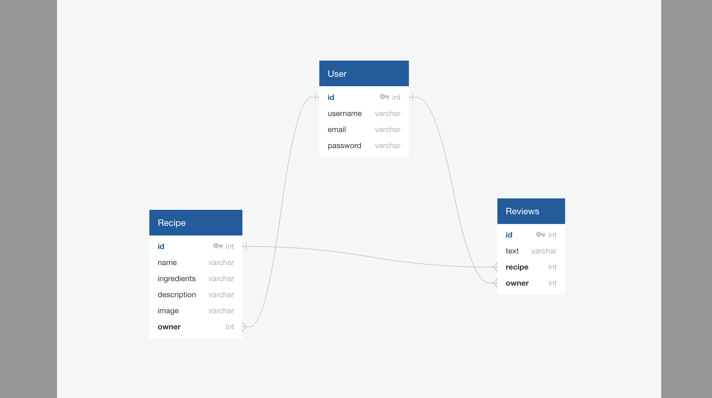

In the end I did a day-to-day planning. I decided to start with the back-end part, then move on to the React framework and finally leave some time for the style.

Part of the planning below.

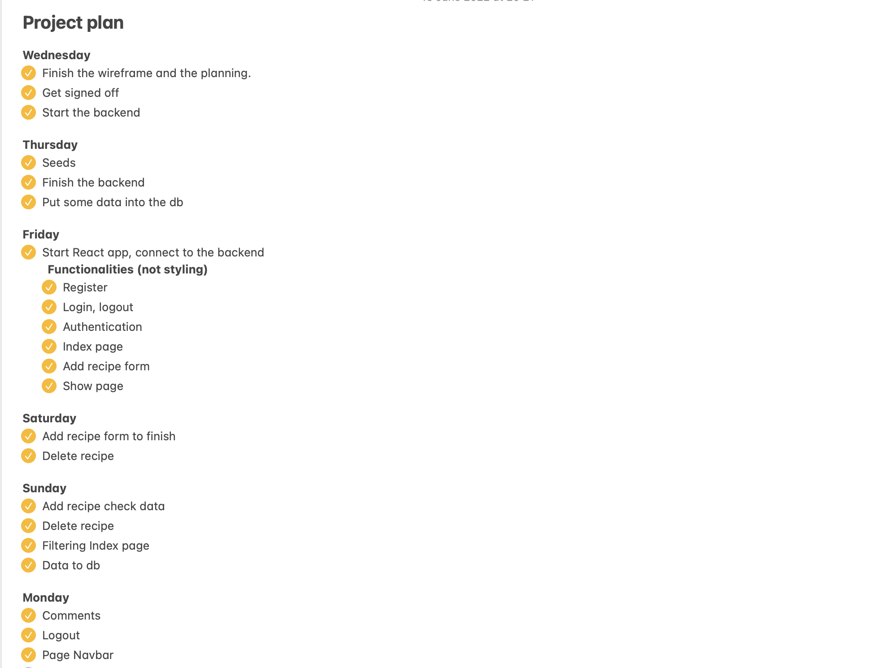

---

## Build process
### Back-end
After the initial project setup I moved on to doing the models, the views and serializers in Django. 

Below, the recipe model.

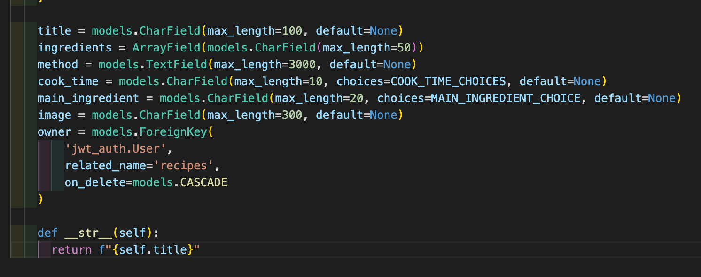

In the image below there are some of the methods I used: GET and POST.

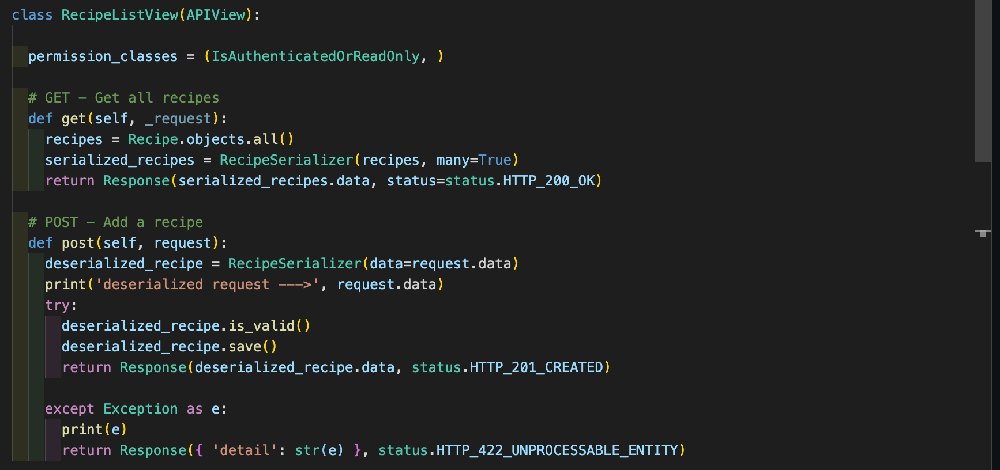

Once I put some data into the database and after the seeding process I tested the methods on Insomnia by making the requests.

### Front-end

The plan for the frontend was to complete all functionality first and then move on to the style. 

I started with authentication, than the register and the login pages.

In the image below, the function triggered by the submit button of the "Register" page.

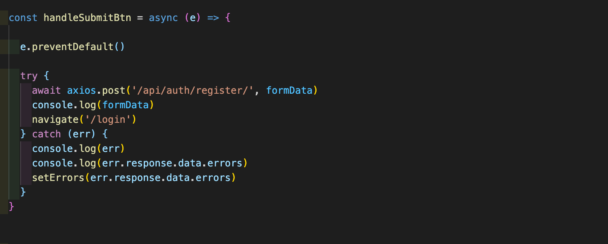

After that I did all functionalities that I made in the backend (GET, POST, UPDATE, DELETE) and I moved on doing the filters component into the recipe index page. 

These are some of the functions that allowed me to filter the recipes by the main ingredient and the cooking time.

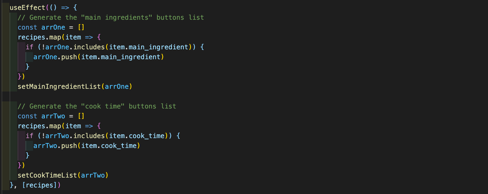

---

I based the style on two colors: one type of green and one type of lilac.

I made the wave on the background thanks to an easy app called "Shape Divider App" that simplified the process. 

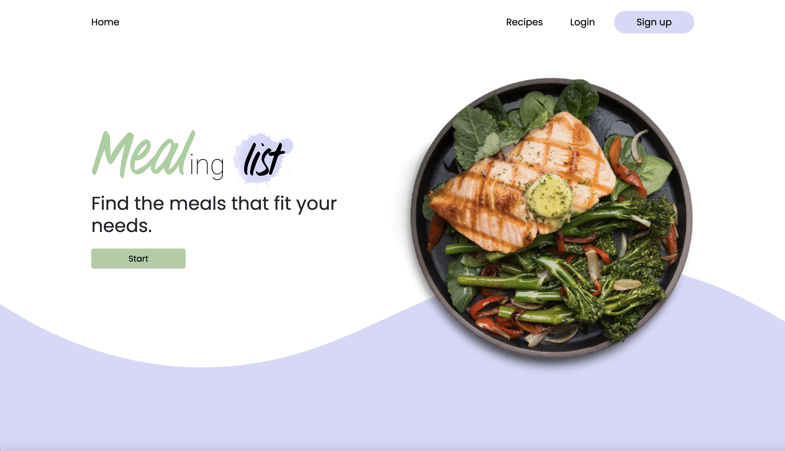

I tried to keep the style clean and quite minimal.

On the image below, the "update recipe" form.

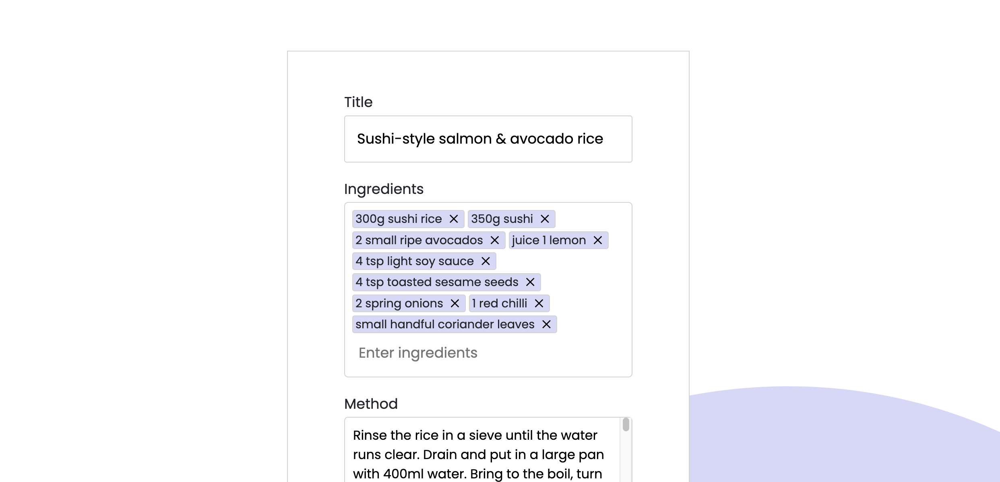

Below, the filters opened into the recipe index page.

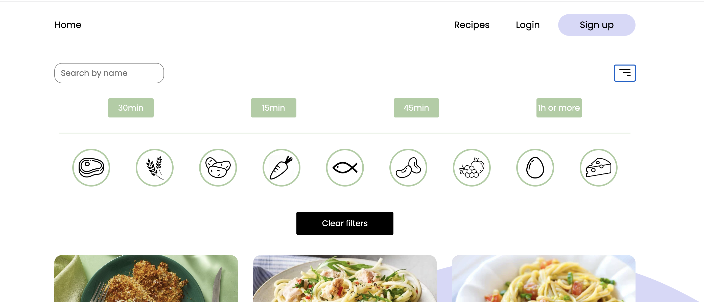

You can open and close filters with a toggle button.
I found the filters images on the web and than I put them inside rounded buttons. They rapresent the main ingredients.

## Wins

- **The backend part went pretty smooth and I got the main functionalities quite fast in React.**
- **I was quite happy with the style, especially that of the homepage.** 

## Challenges
- **Return the previus tags into the update form**  
In order to enter the recipe's ingredients I used a package called 'react-tag-input-component'. It was pretty easy to implement into the app but it was difficult when I got to the part of showing the ingredients, that already existed, within the update form. 
To solve this problem I entered the ingredients separately from the rest.

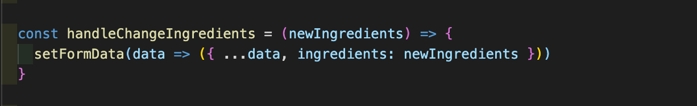

- **Filters**  
Doing three types of filters that work together was pretty challenging. 

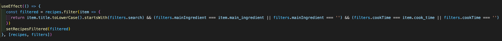

This is the fucntion that made the filters work together.

---

## Key learnings
- **I learnt a lot about React, I feel more confident with it.**
- **I understood much better the authentication process.**
- **I learnt that I need more planning for the style part, because in a project like this there are so much things to style, more than I expected.** 

## Potential future features
- **Make the app responsive**
- **User's profile image**
